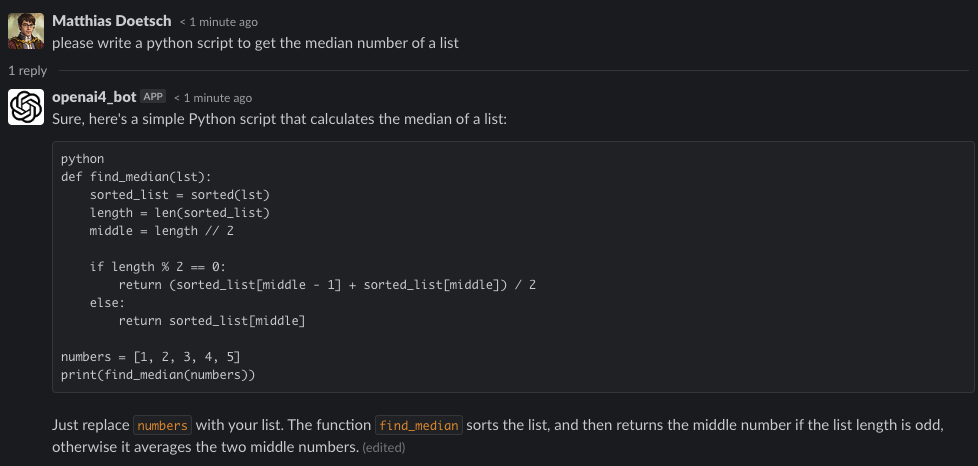

This example demonstrates a minimal bot configuration, disabling most features to provide a straightforward GPT/OpenAI-powered Slack bot.

The bot can be added as a Slack app by any workspace member. It supports direct messages and can also be invited to channels; in channels, it will respond to every message (which may become noisy).

When you send a message to the bot, it replies in a new thread, using the OpenAI API. All further replies within that thread will include the full thread history as context, enabling OpenAI to generate more relevant responses.

**Data privacy note:** By default, all messages, responses, and some metadata (e.g., model used) are logged to a file. To disable logging, set `logger.level` to `warning` in the configuration.

---

**Example conversation:**

# Setup

## 1. Create the Slack App
Refer to the [main readme section](../../readme.md#1st-createprepare-the-slack-app) for detailed steps.

## 2. Create an OpenAI Access Token
- Register at https://openai.com
- Generate a new [OpenAI API key](https://platform.openai.com/account/api-keys)

## 3. Configuration
Edit [config.yaml](./config.yaml) in this directory and replace all Slack and OpenAI tokens with your own.

## 4. Run the Bot
See instructions in the [main readme](../../readme.md#3rd-run-the-bot).

## 5. Add the Bot to Slack
In the Slack client, click "Add Apps" in the lower left corner and search for your app's name. Once added, it will appear in the sidebar and you can start interacting with it.
