# Slack Bot
A Slack bot for development teams, with Jenkins, GitHub, GitLab, Bitbucket and Jira integrations out of the box.
Custom commands, macros, crons and other project-specific commands are easy to add on top.

[](https://github.com/innogames/slack-bot/actions)
[](https://pkg.go.dev/github.com/innogames/slack-bot/v2/)
[](https://goreportcard.com/report/github.com/innogames/slack-bot/v2)
[](https://github.com/innogames/slack-bot/releases)
[](https://codecov.io/gh/innogames/slack-bot)
[](https://opensource.org/licenses/MIT)
[](https://hub.docker.com/r/brainexe/slack-bot)
[](https://github.com/avelino/awesome-go)

**Contents**
- [Installation](#installation)
- [Usage](#usage)
- [Commands](#commands)
- [Configuration](#configuration)
- [Development](#development)

# Installation
## 1. Create the Slack app
1. [Create a new Slack app](https://api.slack.com/apps?new_app=1) and choose "From an app manifest".
2. Select your workspace.
3. Paste the following manifest:
<details>
    <summary>App manifest</summary>

```yaml
_metadata:
  major_version: 1
  minor_version: 1
display_information:
  name: slack_bot
  background_color: "#382e38"
features:
  app_home:
    messages_tab_enabled: true
    messages_tab_read_only_enabled: false
  bot_user:
    display_name: bot
    always_online: true
oauth_config:
  scopes:
    bot:
      - app_mentions:read
      - channels:read
      - channels:history
      - groups:history
      - chat:write
      - im:history
      - im:write
      - mpim:history
      - reactions:read
      - reactions:write
      - users:read
      - files:read
      - pins:write
settings:
  event_subscriptions:
    bot_events:
      - app_mention
      - message.im
  interactivity:
    is_enabled: true
  org_deploy_enabled: false
  socket_mode_enabled: true
  token_rotation_enabled: false
```
</details>

4. Create the app.
5. Under "Basic Information" → "Display Information", upload an icon (at least 512px) and set a name.
6. Under "App Home" → "Show Tabs", enable "Allow users to send Slash commands and messages from the messages tab".
7. Under "Basic Information" → "App-Level Tokens", click "Generate Token and Scopes". Pick any name (e.g. "bot token") and add the `connections:write` scope.
8. Copy the generated token (starts with `xapp-`) into `slack.socket_token` in your `config.yaml`.
9. Install the app to your workspace via "Basic Information" → "Install to Workspace" (or "Request to Install", depending on your workspace settings).
10. Copy the bot token from the "Install App" tab (starts with `xoxb-`) into `slack.token`.

Now you can invite the bot to channels or send it a direct message.

## 2. Create the config
Create a `config.yaml`, using [config.example.yaml](./config.example.yaml) as a starting point. Only `slack.token` and `slack.socket_token` are required. Everything else is optional. See [Configuration](#configuration) for details.

## 3. Run the bot
### With Go
Requires [Go 1.26 or later](https://go.dev/doc/install).
```
go run github.com/innogames/slack-bot/v2/cmd/bot
```

### With Docker Compose
1. [Install Docker](https://docs.docker.com/get-docker/).
2. Clone this repository, or just download the [docker-compose.yaml](./docker-compose.yaml).
3. Add your Slack user ID or username to `allowed_users` in the `config.yaml`.
4. Run `docker compose up`.

### From source
If you want to work on the bot itself:
```
git clone https://github.com/innogames/slack-bot.git
cd slack-bot
make run   # builds and starts the bot, including the plugins of the config.yaml
```

### With plugins
[Plugins](./docs/plugins.md) are listed in the `plugins` section of the config. The `slack-bot-builder` builds a bot binary including them:
```
go run github.com/innogames/slack-bot/v2/cmd/slack-bot-builder@latest -config config.yaml -output ./slack-bot
./slack-bot -config config.yaml
```

### Command-line flags
- `-config <path>`: config file to load, default `config.yaml`. If you pass a directory, all `*.yaml` files in it are loaded, see [Configuration](#configuration).
- `-verbose`: enable debug logging.
- `-show-config`: print the effective config and exit.

# Usage
Send commands to the bot in a direct message. In channels, mention the bot first, e.g. `@bot start job DailyDeployment`.

The bot only handles commands in channels it has been invited to.

# Commands
## Help
`help` lists all available commands. `help <command>` shows a description and examples for a single command.

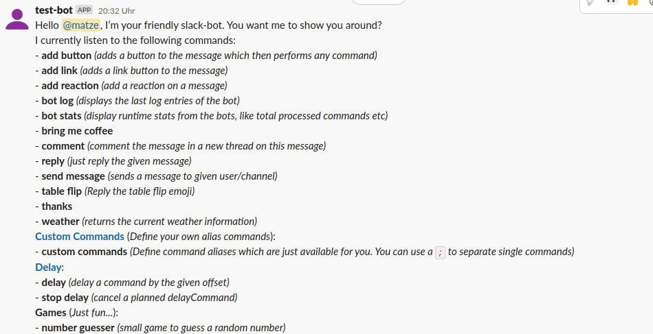

## Jenkins
Start and monitor Jenkins jobs from Slack. These commands only appear once `jenkins.host` is configured. See [Jenkins config](#jenkins-config).

### Start jobs
`start job` (or `trigger job`) starts a job and shows its progress. Only jobs listed in the config can be started.

After a job starts, the bot shows the estimated build time and buttons to open the log or abort the build. Once the build finishes, you get a notification with the result, including the error log if it failed.

If [branch lookup](#branch-lookup) is configured, you don't have to type full branch names. The bot finds the branch that matches your search term.

Each job can also have a custom `trigger`: a regular expression whose named groups are mapped to job parameters. This lets you write commands like `deploy feature-123 to staging`.

**Examples:**
- `trigger job DeployBeta`
- `start job BackendTests TEST-123`: runs on the branch that contains "TEST-123", e.g. `feature/TEST-123-new-login`

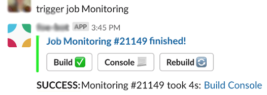

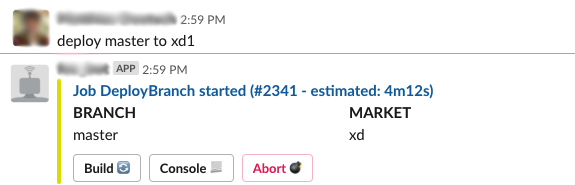

For jobs with `needs_approval: true`, the bot first sends you the parameters in a direct message and waits for confirmation:
- `jenkins approve <id>`
- `jenkins reject <id>`

### Build notifications
Get a one-time notification when a running build finishes. This is useful for long-running jobs.

**Examples:**
- `inform me about build NightlyTests`: watches the latest running build
- `inform me about build NightlyTests #423`: watches a specific build
- `inform job NightlyTests`: short form

### Job notifications
Get a message for every build of a job:
- `watch JenkinsSelfCheck`
- `unwatch JenkinsSelfCheck`

### Enable/disable jobs
- `disable job NightlyTests`
- `enable job NightlyTests`

### Retry builds
- `retry build NightlyTests`: retries the last build
- `retry build NightlyTests #100`: retries build #100

### Nodes
`list jenkins nodes` shows all Jenkins nodes, their online/offline status and their executors.

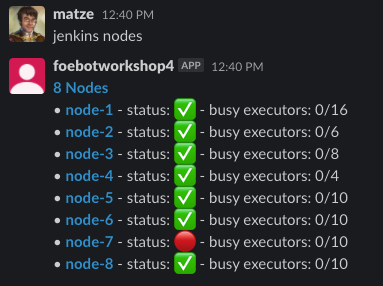

To get notified when Jenkins has nothing left to do:
- `wait until jenkins is idle`
- `wait until jenkins node build-01 is idle`

## Pull requests
Paste a link to a GitHub pull request, GitLab merge request or Bitbucket pull request, and the bot tracks its state with reactions:
- 👀 when someone is reviewing it, so others know it's already taken
- ✅ when it's approved
- 🔀 when it's merged
- ❌ when it's closed

GitHub links work without any setup. A `github.access_token` is only needed for private repositories. GitLab needs `gitlab.host` and `gitlab.accesstoken`. Bitbucket needs the `bitbucket` block, see [Branch lookup](#branch-lookup).

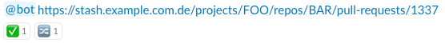

You can override the reactions. You can also set a separate "approved" reaction per reviewer, so you can see at a glance which team approved:
<details>
    <summary>Example</summary>

```yaml
pullrequest:
  reactions:
    in_review: 👀
    merged: custom_merge_arrow
  custom_approve_reaction:
    nerdydev: "approved_backend"
    iamamobiledev: "approved_mobile"
    iamamobiledev2: "approved_mobile"
```
</details>

**Jira priority reactions**

If [Jira](#jira) is configured, the bot also adds a reaction for the priority of the linked Jira ticket. It looks for the ticket key in the branch name first (e.g. `bugfix/TEST-123-fix-xyz`), then in the PR title (e.g. `TEST-123: fix login`). The defaults are the `jira_*` emojis shown below:
<details>
    <summary>Example</summary>

```yaml
pullrequest:
  jira_priority_reactions:
    Blocker: "jira_blocker"
    Critical: "jira_critical"
    Major: "jira_major"
    Medium: "jira_medium"
    Minor: "jira_minor"
```
</details>

**Build status (Bitbucket)**

For Bitbucket, the bot also shows the build status reported by Jenkins, Bamboo and similar tools. Running builds get a 🔄 reaction and failed builds get a 🔥. Both reactions disappear once the build is green.

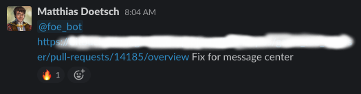

**Private notifications**

`pullrequest.notifications` can also send PR authors a direct message about their pull request. Each notification has its own option:
- build status changes: `build_status_in_progress`, `build_status_success`, `build_status_failed`
- the PR became mergeable: `pr_status_mergeable`
- new review comments: `new_review_comments`, enabled per repository

## GitLab pipelines
`gitlab notify <url>` watches a GitLab pipeline or job and tells you when it finishes. Requires `gitlab.host` and `gitlab.accesstoken`.

## Jira
Look up single tickets or lists of tickets. These commands only appear once `jira.host` is configured.

**Examples:**
- `jira TEST-1234`
- `jira 1234`: uses the default project from `jira.project`
- `jira "second city"`: text search in the default project
- `jql type=bug and status=open`: runs a JQL query (the default project is applied automatically)
- `jira link TEST-1234`: posts only the link
- `issue TEST-1234`: alias for `jira`

Pasting a Jira ticket URL also shows the ticket.

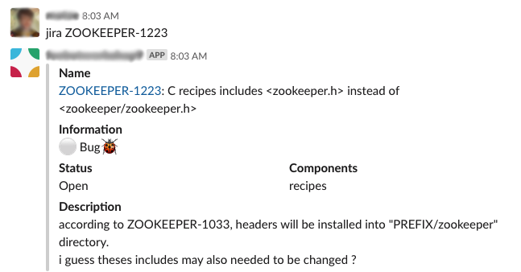

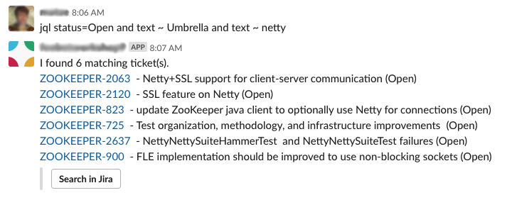

**More Jira commands:**
- `watch ticket PROJ-12234`: notifies you when the ticket's status changes
- `add comment to ticket PROJ-12234 Fixed on staging`

## Queue
`queue` (alias `then`) runs a command once the currently running command, such as a Jenkins build, has finished.

For example, to build a branch and then deploy it:
- `trigger job Build feature-1234`
- `queue trigger job DeployBranch feature-1234`
- `queue reply Deployment is done!`

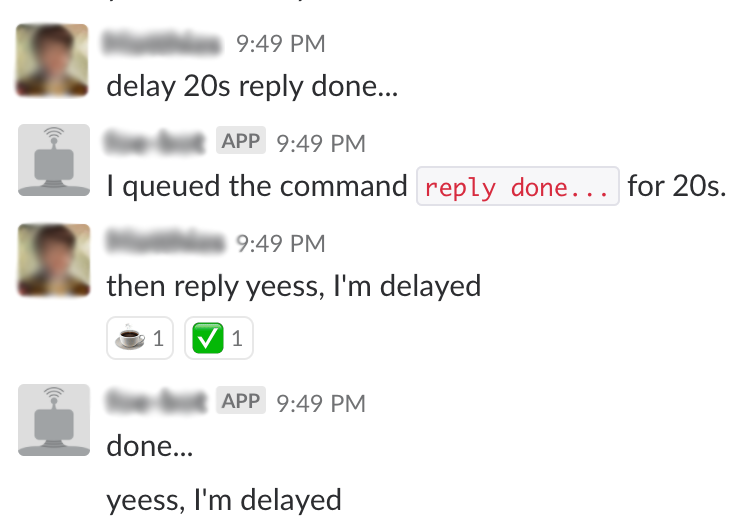

To list background tasks such as running Jenkins builds and watched pull requests:
- `list queue`: tasks you started
- `list queue in channel`: tasks started in the current channel

## Delay
`delay <duration> <command>` runs a command after a delay. The bot replies with a command to cancel it (e.g. `stop timer 123456`), which anyone can send.
This is useful for announcing deployments: if something comes up, anyone can stop it in time.

**Examples:**
- `delay 10m trigger job DeployWorldwide`
- `delay 1h reply Time for a break`
- `delay 5m quiet reply Standup!`: doesn't post the confirmation with the stop button

## Retry
`retry` (or `repeat`) runs your last command again, e.g. after a failed Jenkins job was fixed.
If you paste a link to a Slack message, the bot runs the command from that message.

## Reply and send message
These commands are mostly used in [defined commands](#defined-commands), crons and Jenkins hooks.

- `reply <text>`: replies in the current channel
- `hidden reply <text>`: replies with an ephemeral message that only you can see
- `comment <text>`: replies in a thread
- `send message #backend The job failed :panic:`
- `send message to @peter_pan Don't forget the release notes`

## Buttons, links and reactions
- `add button "Start Deployment" "trigger job LiveDeployment"`: posts a button that runs the given command when clicked. Only allowed users can click it, and each button works only once.
- `add link Jenkins https://jenkins.example.com`: posts a link button
- `add reaction :white_check_mark:` / `remove reaction :white_check_mark:`

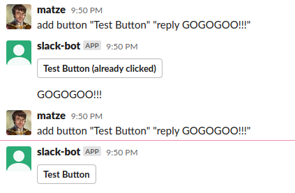

## Custom commands
Each user can define their own shortcuts for commands they use often:
- `add command 'deploy me' 'trigger job RestoreWorld 7'`: afterwards, `deploy me` runs the job
- `add command 'build master' 'trigger job Deploy master ; then trigger job DeployClient master'`
- `list commands`
- `delete command 'build master'`
- `export commands`

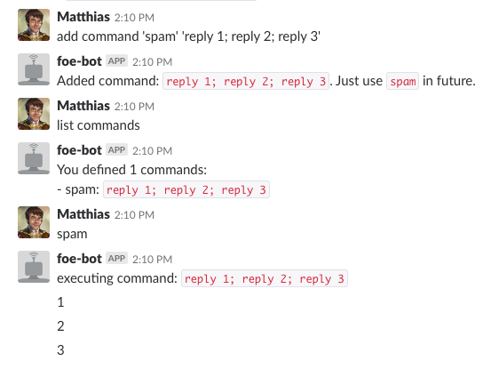

## Custom variables
Users can store their own values, which [defined commands](#defined-commands) can read with `customVariable`. For example, each developer can have their own test server:

```yaml
commands:
  - name: Deploy
    trigger: "deploy (?P<branch>.*)"
    commands:
      - deploy {{ .branch }} to {{ customVariable "defaultServer" }}
```

Each developer sets their server once with `set variable defaultServer foobarX.local`. After that, `deploy master` deploys the master branch to their server.

- `set variable <name> <value>`
- `list variables`
- `delete variable <name>`

## Defined commands
Defined commands (formerly "macros") are set up in the YAML config. Each has a `trigger` regular expression and a list of commands to run. Named groups in the regex are available as template variables.

This example builds two clients from the same branch:
```yaml
commands:
  - name: build clients
    trigger: "build clients (?P<branch>.*)"
    commands:
      - "reply I'll build {{ .branch }} for you"
      - "trigger job BuildFrontendClient {{ .branch }}"
      - "trigger job BuildMobileClient {{ .branch }}"
      - "then reply done! :checkmark:"
```
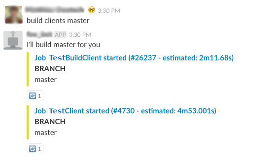

Commands are [Go templates](https://pkg.go.dev/text/template), so you can use conditions and loops. This example posts a link to a Jira ticket in the channel:

```yaml
commands:
  - name: demo
    trigger: "demo (?P<ticketId>\\w+-\\d+)"
    commands:
      - |
        {{ $ticket := jiraTicket .ticketId }}
        {{ if $ticket }}
          reply <!here> demo for <{{ jiraTicketUrl $ticket.Key }}|{{ $ticket.Key }}: {{ $ticket.Fields.Summary }}>
        {{ else }}
          reply Ticket {{ .ticketId }} not found :white_frowning_face:
        {{ end }}
    description: Announces a demo of a Jira ticket in the current channel
    examples:
      - demo XYZ-1232
```

### Template functions
Templates can also call bot-specific functions, like `jiraTicket`, `customVariable`, `countBackgroundJobs` or `openai`. To list all functions with their arguments, send `list template functions`.

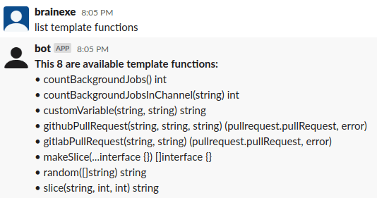

Templates work in:
- [Defined commands](#defined-commands)
- [Crons](#cron)
- [Custom commands](#custom-commands)
- [Jenkins hooks](#jenkins-jobs) (e.g. a custom message when a job fails)

## OpenAI / ChatGPT
Start a conversation with the OpenAI API by prefixing your question with `openai` or `chatgpt`. The bot replies in a new thread. Keep replying in that thread to continue the conversation, and the earlier messages are used as context.

Requires `openai.api_key` in the config.

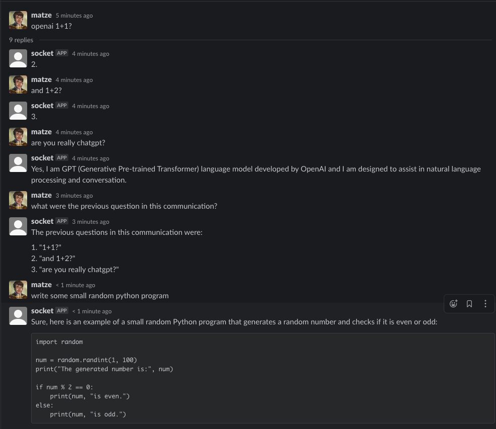

### Hashtag options
Add these hashtags to your message to change how a single request is handled. They work in new conversations and in thread replies.

| Hashtag | Effect |
|---|---|
| `#model-<name>` | use a different model, e.g. `#model-gpt-4o` |
| `#high-thinking`, `#medium-thinking`, `#minimal-thinking` | set the reasoning effort |
| `#no-thinking` | disable reasoning for a faster answer |
| `#message-history` | include the last 10 channel messages as context |
| `#message-history-<N>` | include the last N channel messages |
| `#no-streaming` | post the full answer at once instead of updating the message while it's generated |
| `#no-thread` | reply directly instead of in a new thread (for top-level channel messages only) |
| `#debug` | append the model, token counts, timing and context details |

**Examples:**
- `openai #model-gpt-4o What's the best way to handle errors in Go?`
- `chatgpt #high-thinking Design a distributed caching system`
- `openai #message-history-20 Summarize what we discussed about this bug`
- `openai #no-thread Quick question`

### Config
```yaml
openai:
  api_key: "sk-123....789"
  model: gpt-5.2                 # default
  initial_system_message: "You are a Slack bot for Project XYZ. Keep answers short."
  history_size: 25               # number of thread messages sent as context
  update_interval: 3s            # update the message less often while it's generated
  use_as_fallback: false         # answer every message that doesn't match another command
  log_texts: false               # log all prompts and answers
```

The `openai` function is also available in templates:
`{{ openai "Say some short welcome words to @Jon_Doe" }}` produces something like "Hello Jon, welcome! How can I help you today?"

### DALL-E
Prefix a prompt with `dalle` (or `generate image`) to generate an image with [DALL-E](https://openai.com/dall-e-3).

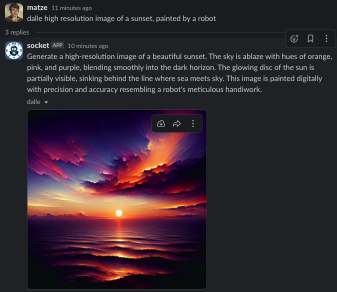

## Pool
Lets users lock shared resources such as test servers, so two people don't use the same one. Locks expire after `lockduration`.

- `pool lock`: locks any free resource
- `pool lock xa testing the new login`: locks a specific resource, with an optional reason
- `pool unlock xa`
- `pool extend xa 2h`
- `pool locks`: your current locks
- `pool list [free|used|locked]`
- `pool info [free|used|locked]`

```yaml
pool:
  lockduration: 2h
  notifyexpire: 30m   # remind the user before a lock expires
  resources:
    - name: xa
      explicitlock: true   # only locked via "pool lock xa", never picked automatically
      addresses:
        - "web: https://xa.local"
      features:
        - "usb plugs"
```

## Plugins
Commands with special use cases or heavy dependencies are plugins, which are compiled into the bot on demand,
see [docs/plugins.md](./docs/plugins.md). Official plugins:
- `aws`: `aws cf list`, `aws cf clean <distribution> at <path>`, `ecs ls <cluster>` and `ecs restart <cluster> <service>`
- `ripeatlas`: `credits` and `traceroute <destination>` via [RIPE Atlas](https://atlas.ripe.net/)
- `weather`: `weather` and `weather in Berlin` via [OpenWeatherMap](https://openweathermap.org/)

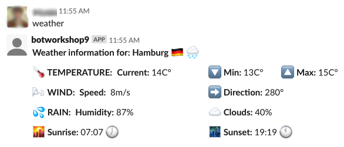

## Other commands
- `random Pizza Pasta`: picks one of the given options at random
- `notify user @someone active`: notifies you when a user's status changes to active (or `away`)
- `request --url=https://example.com/health [--method=POST]`: sends an HTTP request and shows the response
- `export channel #general as csv`: exports the channel's message history as a CSV file
- `list crons`: lists the configured crons and when they run next
- `list branches`: lists the branches known to the branch lookup
- `ping`: checks that the bot is running
- `bot stats`: shows runtime statistics
- `bot log`: shows the bot's recent log lines (only for users in `admin_users`)

# Configuration
The configuration consists of one or more YAML files. They contain the credentials for external services, custom commands, crons, and so on.

A single `config.yaml` is enough and is loaded by default. For larger setups, you can split the config into several files, for example:
- `secret.yaml`: credentials for Slack, Jenkins and so on (e.g. managed by Puppet or Ansible)
- `jenkins.yaml`: Jenkins jobs and their parameters
- `project-x.yaml`: commands for one team

Put them in one directory and start the bot with `-config /path/to/config/`. All `*.yaml` files in the directory are merged into one config.

## Slack
The bot needs a bot token and a socket token. See [Create the Slack app](#1-create-the-slack-app).

```yaml
slack:
  token: xoxb-...
  socket_token: xapp-...

# who may use the bot (user IDs or names)
allowed_users:
  - U12345678
# who may use admin commands like "bot log"
admin_users:
  - U12345678
```

## Jenkins config
To start or watch Jenkins jobs, configure the host and credentials. The user needs read access to the jobs and permission to build the jobs you list.
```yaml
jenkins:
  host: https://jenkins.example.com
  username: jenkinsuser
  password: secret
```

### Jenkins jobs
Only jobs listed in the config can be started. A job without parameters:
```yaml
jenkins:
  jobs:
    CleanupJob:
```
Start it with `trigger job CleanupJob` or `start job CleanupJob`.

A job with two parameters:
```yaml
jenkins:
  jobs:
    RunTests:
      parameters:
        - name: BRANCH
          default: master
          type: branch
        - name: GROUP
          default: all
```
- `start job RunTests` runs all groups on master.
- `start job RunTests JIRA-1224 unit` runs the unit group on the branch matching "JIRA-1224". If more than one branch matches, the bot returns an error.

Supported parameter types:
- `branch`: resolved by the [branch lookup](#branch-lookup)
- `bool`
- `lowerCase`
- `upperCase`

A job with a custom trigger and hooks:
```yaml
jenkins:
  jobs:
    DeployBranch:
      trigger: "deploy (?P<BRANCH>[\\w\\-_\\.\\/]*) to (?P<ENVIRONMENT>prod|test|dev)"
      parameters:
        - name: BRANCH
          default: master
          type: branch
        - name: ENVIRONMENT
      onsuccess:
        - reply Deployed {{ .BRANCH }}: http://{{ .ENVIRONMENT }}.example.com
      onfailure:
        - reply <!here> Deployment of {{ .BRANCH }} to {{ .ENVIRONMENT }} failed
```
Named groups in the `trigger` are mapped to job parameters, so `deploy bugfix-1234 to test` starts the job. `start job DeployBranch master test` still works as well.

Hooks run for builds started by the bot:
- `onstart`: runs when the build starts
- `onsuccess`: runs when the build succeeds
- `onfailure`: runs when the build fails

Job parameters are available as template variables in all hooks.

With `needs_approval: true`, the bot asks for confirmation before it starts the job. Unconfirmed requests expire after `jenkins.approval_timeout` (default 5m).

## Cron
Run commands periodically, using the [robfig/cron](https://github.com/robfig/cron) syntax:
```yaml
crons:
  - schedule: "0 8 * * MON-FRI"
    channel: "#backend"
    commands:
      - trigger job BuildClients
      - then deploy master to staging
```

Cron commands are templates, so they can contain conditions:
```yaml
crons:
  - schedule: "CRON_TZ=Europe/Berlin 0 9,13,16 * * MON-FRI"
    channel: "#pull-requests"
    commands:
      - |
        {{ $prs := countBackgroundJobsInChannel "C12121" }}
        {{ if gt $prs 5 }}
          reply <!here> There are *{{ $prs }}* open pull requests, please take a look :scream:
        {{ end }}
```

## Branch lookup
The branch lookup resolves partial branch names for Jenkins `branch` parameters. It supports Stash/Bitbucket and plain Git repositories:
```yaml
branch_lookup:
  type: bitbucket          # stash, bitbucket or git
  repository: repo_name    # for "git": the repository URL
  update_interval: 2m

bitbucket:
  host: https://bitbucket.example.com
  username: readonlyuser
  password: secret         # or api_key
  project: MyProjectKey
  repository: repo_name
```
Without a branch lookup, branch parameters are passed to Jenkins exactly as typed.

## Enabling and disabling features
Most integrations are off until they are configured: Jenkins and Jira (`host`), GitLab, Bitbucket and OpenAI (API key or host), Pool (`pool.resources`) and crons. Plugins are only loaded when they are listed in the `plugins` section, see [docs/plugins.md](./docs/plugins.md).

Custom commands and custom variables are on by default. To turn them off:
```yaml
custom_commands:
  enabled: false

custom_variables:
  enabled: false
```

# Development
## File structure
- `bot/`: the bot core: Slack connection, config, user management, command matching, storage
- `client/`: clients for external services (Slack, Jira, Bitbucket, ...)
- `command/`: the commands, each implementing the `bot.Command` interface
- `plugins/`: the official [plugins](./docs/plugins.md), each one is its own Go module
- `cmd/bot/`: entry point of the bot
- `cmd/cli/`: entry point of the local CLI tool
- `cmd/slack-bot-builder/`: builds a bot binary including the plugins of a config
- `examples/`: example setups, e.g. `examples/custom_build` to build your own bot with plugins

## Writing a new command
If a [defined command](#defined-commands) isn't enough, you can write the command in Go. Commands for special use cases, or with additional dependencies, should be a [plugin](./docs/plugins.md#writing-a-plugin) instead:
1. Add a file in `command/` or one of its subpackages.
2. Create a struct that implements `bot.Command`. `GetMatcher()` defines which messages the command handles. Most commands need a `client.SlackClient` to reply.
3. Implement `bot.HelpProvider`, so the command shows up in `help`.
4. Register the command in `command/commands.go`.
5. Add a test. See the existing `*_test.go` files and the `bot/tester` package.

## CLI tool
The CLI tool lets you chat with the bot in your terminal, without a Slack connection:
```
make run-cli
```
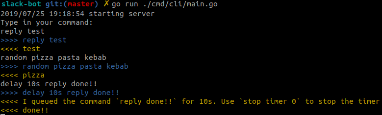

## Live reload
`make run-live-reload` restarts the bot on every code change, using [air](https://github.com/air-verse/air).

## Testing
```
make test            # run all tests
make test-race       # with the race detector
make test-coverage   # writes the coverage report to build/cover.html
make lint            # golangci-lint, fixes issues automatically
```
