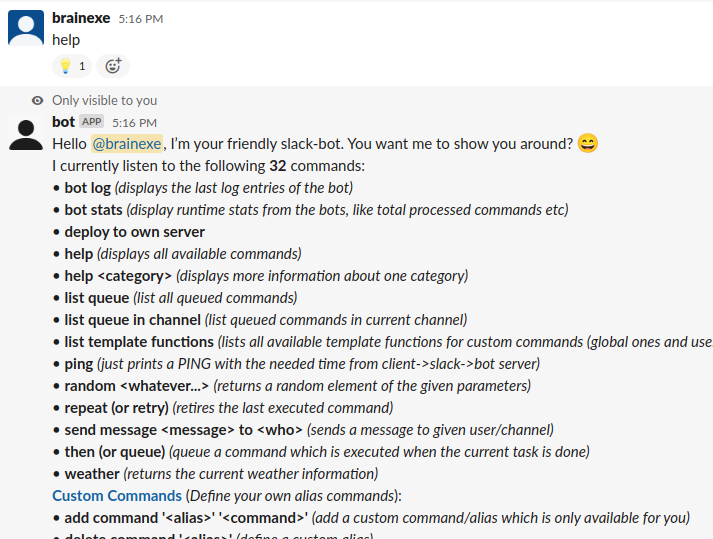
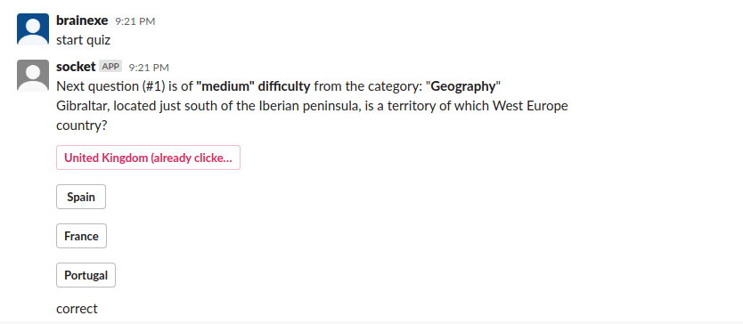
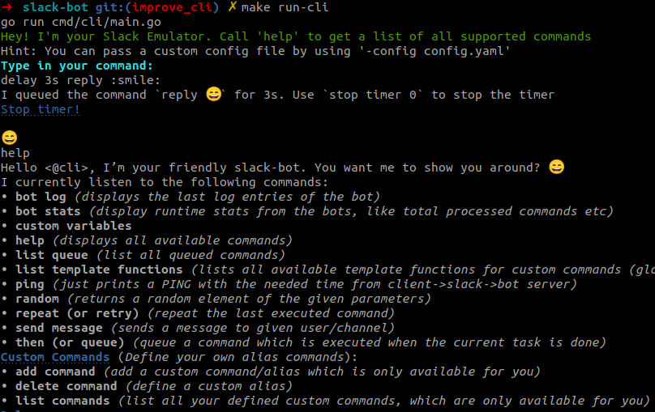

# Slack Bot
This slack bot improves the workflow of development teams. Especially with focus on Jenkins and Jira integration.

[](https://github.com/innogames/slack-bot/actions)
[](https://pkg.go.dev/github.com/innogames/slack-bot/)
[](https://goreportcard.com/report/github.com/innogames/slack-bot)
[](https://github.com/innogames/slack-bot/releases)
[](https://codecov.io/gh/innogames/slack-bot)
[](https://opensource.org/licenses/MIT)
[](https://hub.docker.com/r/brainexe/slack-bot)

# Installation
**1st) Create+prepare the Slack App:**
- Create a [Slack App](https://api.slack.com/app)
- Go to "Socket Mode" menu and activate it. 
- - use any token name, like "Slack-Bot Socket Mode token"
- - You will see a App-Level Token (beginning with xapp-). Sse it in the config.yaml as slack.socket_token.
- Enable "Interactivity & Shortcuts" 
- Enable "Event Subscriptions":
- - if you see a "Send events to my app using the new format" checkbox, check it (only for old migrated apps)  
- - in "Subscribe to bot events", add "app_mention" and "message.im" events
- Go to "OAuth & Permissions":
- - use the "Bot User OAuth Access Token" (beginning with "xoxb-") as slack.token in the config.yaml
- - in "Scopes" add "app_mentions:read", "channels:read", "chat:write", "im:history", "users:read"   
- Go to "Install your App" and "Install your app to your workspace"
- Back to "Install app" tab, the "Bot User OAuth Access Token" is visible (starts with "xoxb-"). You need this one in the config.yaml in slack->token.

**2nd) Run the bot - Quick steps:** (just use the bot via Docker)
- [install Docker incl. docker-compose](https://docs.docker.com/get-docker/)
- clone this repo or at least fetch the docker-compose.yaml
- create a config.yaml (at least a slack token is required) or take a look in config-example.yaml
- add your Slack user id or user name in the "allowed_users:" section of the config.yaml
- `docker-compose up`

**2nd) Advanced** (when planning working on the bot core)
- install go (at least 1.14)
- clone/fork this repo
- create a config.yaml (at least a slack token is required) or take a look in config-example.yaml
- run `go run cmd/bot/main.go` to run the go application


# Usage
As slack user, you just have to send a private message to the bot user/app containing the command to execute.
Additionally you can execute bot commands in channels by prefix your command with @bot_name, e.g. `@slack-bot start job DailyDeployment`

**Note:** You have to invite the bot into the channel to be able to handle commands.

# Commands
## Help
The `help` command just prints a list of all available commands of this bot. 
With `help *command*` you'll get a short description and some examples for a single command.



## Jenkins
The bot is able to start and monitor jenkins job on a simple but powerful way.

By default the commands are not available and not visible in the "help", till the "jenkins.host" is defined in the config file.

### Start Jenkins jobs
The `start job` command starts a Jenkins job and shows the current progress. **Attention:** only whitelisted jobs in the config are startable!

In additions each job can have a configurable `trigger` which make it possible to create custom commands to start jobs. (it's a regexp which takes parameter names into account).
E.g. "start daily deployment" could be the trigger for one jenkins job. Sending this text to the bot would start he job.

After starting a job the bot will show the estimated build time and some action buttons. There you can open the logs or abort the build directly.

The bot is also able to parse parameters and lookup branch names using a fuzzy branch search.

**Examples:**
- `trigger job DeployBeta`
- `start job BackendTests TEST-123` (search for a full branch name, containing TEST-123. e.g. feature/TEST-123-added-feature-456)


### Jenkins build notifications
The bot has also the possibility to create one time notifications for jenkins builds. This might be useful for long running jobs where the devs is waiting for the result.

**Example:**
- `inform me about build NightlyTests` (watches the most recent running build)
- `inform me about build MyJobName #423` (specify a build number)
- `inform job MyJobName` (alternative syntax)

### Jenkins job notifications
Receive slack messages for all process builds for the given job:

**Example:**
- `watch JenkinsSelfCheck` notifies about any build of Job `JenkinsSelfCheck`
- `unwatch JenkinsSelfCheck`

### Jenkins status
Small command to disable/enable job execution on Jenkins side.

**Example:**
- `disable job NightlyTests` (disable job on jenkins)
- `enable job NightlyTests`

### Jenkins retry
When a build failed you are able to retry any build by:

**Example:**
- `retry build NightlyTests` (retries the last build of a job)
- `retry build NightlyTests #100` (retries given build)

### Nodes
`jenkins nodes` lists all available Jenkins nodes. The online/offline status and number of executors are visible.


## Pull Requests
If you just paste a link to a Github/Gitlab/Bitbucket/Stash Pull request, the bot will track the state of the ticket! 
- When a developer was added as reviewer, it will add a "eyes" reaction to show other devs that someone is already taking a look
- When the reviewer approved the ticket, a checkmark is added
- After merging the pull request, it will add a "merge" reaction


**Extra Features:**
For Bitbucket the bot is able to extract the current build status (e.g. from Jenkins/Bamboo etc) and show failed and running builds (fire reaction) as a reaction (circle arrow reaction). When the build is stable, the build reactions disappear.  


## Command Queue
The `queue` command (with the alias `then`) is able to queue the given command, until the currently running command finished. 

Example following scenario: you have a build job (which might take some minutes) and a deploy job which relies of the build artifacts. Now you can do:
- `trigger job Build feature1234` to start the Build job with given branch
- `queue trigger job DeployBranch feature1234` 
- `queue reply Deployment is done!`

**Other example:**
- `delay 1h`
- `then send message #backend coffee time?`

To see all running background commands (like Jenkins jobs or PR watcher) use this command:
- `list queue`

## Jira
The bot is able to query information from Jira, either from a single ticket, or a whole list of tickets.

By default the commands are not available and not visible in the "help", till the "jira.host" is defined in the config file.

**Examples**
- `jira TEST-1234`
- `jira 1242` (opens the ticket, using the configured default jira project)
- `jql type=bug and status=open` (use default project by default)
- `jira "Second city"` (text search of tickets in default project)


It's also possible to get a notification when there is a state change in a certain Jira ticket.

**Example**
- `watch ticket PROJ-12234`

## Interactions
It's possible to create buttons which are performing any bot action when pressing the button.
[Slack interactions](https://api.slack.com/interactivity/actions)


**Examples:**
 - `add button "Start Deployment" "trigger job LiveDeployment"`

**Note** 
 - only whitelisted users can click the button
 - each button is only active once (but it will stay with the)
 - slack needs to reach the server via public domain/IP! [See this slack documentation](https://api.slack.com/tutorials/tunneling-with-ngrok) about some tricks.
 
**Config without a public reachable IP/Domain**
1) start local [ngrok.io](https://ngrok.io) server (using local port 4390 by default)
2) In [App settings](https://api.slack.com/apps) open the "Interactivity & Shortcuts" for your app and make sure it's enabled.
3) Add the request URL. E.g. https://foobar.eu.ngrok.io/interactions (Note: `/interactions` is the slack-bot handle)
4) In "Basic Information" of the Slack app, use the "Signing Secret" as server.signing_secret below.
5) Add this to the config and start the bot:
```
server:
  listen: 127.0.0.1:4390 # using local ngrok.io tunnel
  verification_secret: 12345678qwertzuiopasdfghj
```
  
## Custom variables
Configure user specific variables to customize bot behaviour. E.g. each developer has his own server environment.

**Example:** Having this global config:
```
commands:
  - name: deploy
    trigger: "deploy (?P<branch>.*)"
    commands:
      - deploy {{.branch}} to {{ customVariable "defaultServer" }}
``` 

User can define his default environment once by using `set variable serverEnvironment aws-02`.

Then the `deploy feature-123` will deploy the branch to the defined `aws-02` environment.
Each user can define his own variables.


## Quiz command
If you need a small break and want to play a little quiz game you can do so by calling this command.
No more than 50 questions are allowed. 
The questions are from different categories and difficult levels and are either multiple choice or true/false questions.

**Commands**
- `quiz 10` to start a quiz with 10 questions 
- `answer 1` to answer a question with the first answer



## Weather command
It's possible to setup [OpenWeatherMap](https://openweathermap.org/) to get information about the current weather at your location.


**Example config:**
```
open_weather:
  apikey: "612325WD623562376678"
  location: "Hamburg, DE"
  units: "metric"
```

## Custom command
Every user is able to define own command aliases. 
This is a handy feature to avoid tying the same command every day.

**Commands**
- `list commands`
- `add command 'myCommand' 'trigger job RestoreWorld 7` -> then just call `myCommand` later
- `add command 'build master' 'trigger job Deploy master ; then trigger job DeployClient master'`
- `delete command 'build master'`
- -> then you can execute `myCommand` to trigger this jenkins job


## Commands
Defined "Commands" (former called "Macros") are very magical and can be defined in the yaml configuration files.

They have a trigger (a regular expression) and have a list of sub commands which will be executed. 
They take parameter groups from regexp into account - so they can be very flexible!

One simple example to start two Jenkins jobs with a given branch name at the same time:
```
commands:
 - name: build clients
   trigger: "build clients (?P<branch>.*)"
   commands:
    - "reply I'll build {{ .branch }} for you"
    - "trigger job BuildFrontendClient {{ .branch }}"
    - "trigger job BuildMobileClient {{ .branch }}"
    - "then reply done! :checkmark:"
```


**Note**: In the commands you can use the full set of [template features of go](https://golang.org/pkg/text/template/) -> loops/conditions are possible!

## Retry
With `retry` or `repeat` your last executed command will be re-executed. -> Useful when a failed Jenkins job got fixed.

## Delay
A small command which might be useful in combination with `command` command or as hook for jenkins jobs.

Example command: `delay 10m trigger job DeployWorldwide`

As reply you'll get a command to stop the queued job (like `stop timer 123456`). As everyone can send the command, the command can be used to announce a deployment and in doubt, the execution can still be stopped by everyone.

## Reply / send message
`reply` and `send message` are also small commands which are useful in combination with `command` or jenkins hooks.

**Examples:**
- `send message to #backend The job failed :panic:`
- `delay 10m send message to @peter_pan I should notify you to...`

## Random
Simple command if you are not able to decide between different options

**Examples**
- `random Pizza Pasta` -> produce either "Pizza" or "Pasta" 
- `random Peter Paul Tom Jan` -> who has to take about organizing food today?

# Installation
1. Make sure Go version 1.12+ is installed
2. clone the project
3. create config file called `config.yaml` (you can take a look at `config.example.yaml`)
 
## Run without docker
This command will start the bot, using the `config.yaml` file by default. Use the `-config` argument to use the config file(s) from another location.
```
go run cmd/bot/main.go
```

## Run via docker-compose
**Attention**: Create a config.yaml file first

```
docker-compose up --build
```

# Configuration
The configuration is managed via simple .yaml files which are storing the credentials for the external services and the custom commands etc.

It's supported to split up the configuration into multiple files.

**Possible structure:**
- `secret.yaml` containing the credentials for the external services (slack, jenkins) - can be managed by puppet/ansible etc.
- `jenkins.yaml` configuration of jenkins job and their parameters etc
- `project-X.yaml` custom commands for a specific team
- `project-Y.yaml`

To load the config files, use `go run cmd/bot/main.go -config /path/to/config/*.yaml` which merged all configs together.

## Slack
To run this bot, you need a "bot token" for your slack application. 

[Take a look here](https://api.slack.com/docs/token-types#bot) how to get one.

## Jenkins
To be able to start or monitor jenkins jobs, you have to setup the host and the credentials first. The user needs read access to the jobs and the right to trigger jobs for your whitelisted jobs.
```
jenkins:
     host: https://jenkins.example.de
     username: jenkinsuser
     password: secret
```

### Jenkins jobs
To be able to start a job, the job and it's parameters have to be defined in the config.

A job without any parameter looks very simple:
```
jenkins:
  jobs:
    CleanupJob:
```
Then you can use `trigger job CleanupJob` or `start job CleanupJob` to start the job. It will also notify you when the job succeeded or failed (incl. error log). 

Next a job with two parameters:
```
jenkins:
  jobs:
    RunTests:
      parameters:
      - name: BRANCH
        default: master
        type: branch
      - name: GROUP
        default: all
```
This job can handle two parameters:
 - BRANCH: VCS branch name, "master" as default
 - GROUP: optional parameter, using "all" as default
        
If you setup the VSC in the config, you don't have to pass the full branch name but can use the fuzzy search.

**Example:**
 - `start job RunTests` would start "all" groups on master branch
 - `start job JIRA-1224 unit` would try to find a matching branch for the ticket number. (Error message if there is no unique search result!)
        
Now a more complex example with more magic: 
```
jenkins:
     jobs:
       DeployBranch:
         trigger: "deploy (?P<BRANCH>[\\w\\-_\\.\\/]*) to (?P<ENVIRONMENT>prod|test|dev)"
         parameters:
         - name: BRANCH
           default: master
           type: branch
         - name: ENVIRONMENT
         onsuccess:
          - reply Tadaa: Take a look on http://{{ .ENVIRONMENT }}.example.com
```
**Step by step:**
The `trigger` is a regular expression to start the job which may contain named groups. The regexp groups will be matched to the job parameters automatically.

Then you can use `deploy bugfix-1234 to test` to start the jenkins job.

**Note:** You can always start this job also via `start job DeployBranch master`. The `trigger` is just an alternative.

The `onsuccess` is a hook which will be executed when a job ist started via this bot. 
In addition `onsuccess` and `onerror` is also available...e.g. to send custom error messages.


### Cron
It's possible to define periodical commands via crons, using the [robfig/cron library](github.com/robfig/cron).

**Example config**
```
crons:
  - schedule: "0 8 * * *"
    commands:
      - trigger job BuildClients
      - then deploy master to staging
    channel: "#backend"
```

## VCS / Stash / Bitbucket
To be able to resolve branch names in jenkins trigger, a VCS system can be configured (at the moment it's just Stash/Bitbucket).
```
vcs:
  type: bitbucket
  host: https://bitbucket.example.com
  username: readonlyuser
  password: secret
  project: MyProjectKey
  repository: repo_name
```
If no config is provided, there is no automated branch lookup and the "branch" parameters are passed 1:1 to the jenkins job.

# Development

## File structure
- `bot` contains the code classes of the bot: connection to slack, user management, command matching
- `cmd` entry points aka main.go for the bot and the CLI test tool
- `command` real command implementing the bot.Command interface
- `client` communication interfaces for Slack, Jenkins, Jira etc...

## Create a new (native) command
If you need a new command, which is not implementable with a "command" command, you have to write to write go code.
- create a new file within the "commands/" directory or one submodule of it
- create a new struct which fulfills the bot.Command interface. The service.SlackClient might be needed as dependency
- GetMatcher() needs to provide the information which command text is matching our command
- register the command in command/commands.go
- restart the bot application
- it's recommended to fulfill the bot.HelpProvider (your command will show up in `help)
- it's also recommended to create a integration test for your command

## CLI tool
There is a handy CLI application which emulates the Slack application...just chat with your local console without any Slack connection!

```
make run-cli
```

## Testing
There are a bunch of tests which can be executed via:
```
make test
```

Test coverage is generated to build/coverage.html
```
make test-coverage
```
