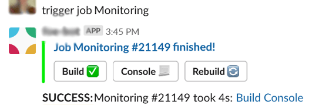
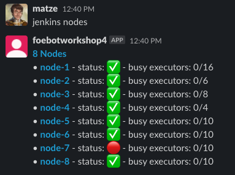
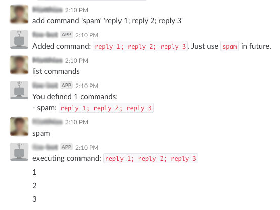

# Slack Bot
This Slack bot improves the workflow of development teams, with a focus on Jenkins, GitHub, GitLab, and Jira integration out of the box.
Custom commands, macros, crons, and other project-specific commands can also be implemented in a simple and flexible way.

[](https://github.com/innogames/slack-bot/actions)
[](https://pkg.go.dev/github.com/innogames/slack-bot/v2/)
[](https://goreportcard.com/report/github.com/innogames/slack-bot/v2)
[](https://github.com/innogames/slack-bot/releases)
[](https://codecov.io/gh/innogames/slack-bot)
[](https://opensource.org/licenses/MIT)
[](https://hub.docker.com/r/brainexe/slack-bot)
[](https://github.com/avelino/awesome-go)

# Installation
## 1st) Create and prepare the Slack App:
### Use Manifest file as App template
1. Create a [Slack App](https://api.slack.com/apps?new_app=1) (click "Create New App")
2. Select "From an app manifest"
3. Select your Workspace
4. Paste this YAML code:
<details>
    <summary>Click to expand!</summary>

```yaml
_metadata:
  major_version: 1
  minor_version: 1
display_information:
  name: slack_bot
  background_color: "#382e38"
features:
  app_home:
    messages_tab_enabled: true
    messages_tab_read_only_enabled: false
  bot_user:
    display_name: bot
    always_online: true
oauth_config:
  scopes:
    bot:
      - app_mentions:read
      - channels:read
      - channels:history
      - groups:history
      - chat:write
      - im:history
      - im:write
      - mpim:history
      - reactions:read
      - reactions:write
      - users:read
      - files:read
      - pins:write
settings:
  event_subscriptions:
    bot_events:
      - app_mention
      - message.im
  interactivity:
    is_enabled: true
  org_deploy_enabled: false
  socket_mode_enabled: true
  token_rotation_enabled: false
```
</details>

5. Create the App!
6. "Basic Information" → "Display Information" → Upload Image (512px+) and set a proper name
7. "App Home" → "Show Tabs" → Check "Allow users to send Slash commands and messages from the messages tab"
8. "Basic Information" → "App-Level Tokens" → "Generate Token and Scopes" → Use "bot token" as token name and "connections:write" as scope
9. You will see an App-Level Token (beginning with xapp-). Set it in the config.yaml as "slack.socket_token".
10. "Basic Information" → "Request to Install" + "Install to Workspace" → Continue there
11. Then you will get another token (displayed in "Install App" tab), starting with "xoxb-". Use it as "slack.token" in the config.yaml
12. In your Slack client, you can now add the bot to any channel or start a private conversation.

## 2nd) Prepare the config

First, prepare the `config.yaml` file. Take a look at [config.example.yaml](./config.example.yaml) for reference.
- At minimum, the Slack token and socket-token are required

## 3rd) Run the bot

### Option 1: Run via Go
1. [Install Go (at least 1.22)](https://go.dev/doc/install)
2. Create a config.yaml (at minimum, the Slack token and socket-token are required) or take a look at config.example.yaml
3. `go run github.com/innogames/slack-bot/v2/cmd/bot`

### Option 2: Via Docker
1. [Install Docker including docker-compose](https://docs.docker.com/get-docker/)
2. Clone this repo or at least fetch the docker-compose.yaml
3. Add your Slack user ID or username in the "allowed_users:" section of the config.yaml
4. `docker-compose up`

### Option 3: Advanced: When planning to work on the bot core
1. [Install Go](https://go.dev/doc/install)
2. Clone/fork this repo
3. Run `go run cmd/bot/main.go` or `make run` to run the Go application

# Usage
As a Slack user, you just need to send a private message to the bot user/app containing the command to execute.
Additionally, you can add the bot to any channel and execute bot commands in it by prefixing your command with @bot_name, e.g., `@slack-bot start job DailyDeployment`

**Note:** You must invite the bot into the channel to be able to handle commands.

# Bot Commands
## Help
The `help` command prints a list of all available commands for this bot. 
With `help *command*` you'll get a short description and some examples for a single command.


## Jenkins
The bot is able to start and monitor Jenkins jobs in a simple but powerful way.

By default, the commands are not available and not visible in the "help" until the "jenkins.host" is defined in the config file.

### Start Jenkins jobs
The `start job` command starts a Jenkins job and shows the current progress. **Attention:** Only whitelisted jobs in the config are startable!

In addition, each job can have a configurable `trigger` which makes it possible to create custom commands to start jobs. (It's a regexp that takes parameter names into account).
E.g., "start daily deployment" could be the trigger for one Jenkins job. Sending this text to the bot would start the job.

After starting a job, the bot will show the estimated build time and some action buttons. There you can open the logs or abort the build directly.

The bot is also able to parse parameters and look up branch names using a fuzzy branch search.

**Examples:**
- `trigger job DeployBeta`
- `start job BackendTests TEST-123` (search for a full branch name containing TEST-123, e.g., feature/TEST-123-added-feature-456)




### Jenkins build notifications
The bot also has the possibility to create one-time notifications for Jenkins builds. This might be useful for long-running jobs where the devs are waiting for the result.

**Examples:**
- `inform me about build NightlyTests` (watches the most recent running build)
- `inform me about build MyJobName #423` (specify a build number)
- `inform job MyJobName` (alternative syntax)

### Jenkins job notifications
Receive Slack messages for all processed builds for the given job:

**Examples:**
- `watch JenkinsSelfCheck` notifies about any build of Job `JenkinsSelfCheck`
- `unwatch JenkinsSelfCheck`

### Jenkins status
Small command to disable/enable job execution on the Jenkins side.

**Examples:**
- `disable job NightlyTests` (disable job on Jenkins)
- `enable job NightlyTests`

### Jenkins retry
When a build fails, you are able to retry any build by:

**Examples:**
- `retry build NightlyTests` (retries the last build of a job)
- `retry build NightlyTests #100` (retries the given build)

### Nodes
`jenkins nodes` lists all available Jenkins nodes. The online/offline status and number of executors are visible.


## Pull Requests
If you just paste a link to a GitHub/GitLab/Bitbucket/Stash Pull Request, the bot will track the state of the ticket!
- When a developer is added as a reviewer, it will add an "eyes" reaction to show other devs that someone is already taking a look
- When the reviewer approves the ticket, a checkmark is added
- After merging the pull request, it will add a "merge" reaction

You're also able to set custom "approved" reactions. E.g., to see directly who or which component/department approved a pull request, you can use the name of the reaction or the Unicode character directly.
<details>
    <summary>Expand example!</summary>

```yaml
pullrequest:
  reactions:
    merged: custom_merge_arrow
    review: 👀
  custom_approve_reaction:
    nerdydev: "approved_backend"
    iamamobiledev: "approved_mobile"
    iamamobiledev2: "approved_mobile"
```
</details>


**Extra Features:**
For Bitbucket, the bot is able to extract the current build status (e.g., from Jenkins/Bamboo etc.) and show failed and running builds (fire reaction) as a reaction (circle arrow reaction). When the build is stable, the build reactions disappear.


## Command Queue
The `queue` command (with the alias `then`) is able to queue the given command until the currently running command finishes. 

Example scenario: You have a build job (which might take some minutes) and a deploy job which relies on the build artifacts. Now you can do:
- `trigger job Build feature1234` to start the Build job with the given branch
- `queue trigger job DeployBranch feature1234` 
- `queue reply Deployment is done!`

**Other examples:**
- `delay 1h`
- `then send message #backend coffee time?`

To see all running background commands (like Jenkins jobs or PR watcher), use this command:
- `list queue`

## Jira
The bot is able to query information from Jira, either from a single ticket or a whole list of tickets.

By default, the commands are not available and not visible in the "help" until the "jira.host" is defined in the config file.

**Examples:**
- `jira TEST-1234`
- `jira 1242` (opens the ticket using the configured default Jira project)
- `jql type=bug and status=open` (uses default project by default)
- `jira "Second city"` (text search of tickets in the default project)


It's also possible to get a notification when there is a state change in a certain Jira ticket.

**Example:**
- `watch ticket PROJ-12234`

## Interactions
It's possible to create buttons which perform any bot action when pressed.
[Slack interactions](https://api.slack.com/interactivity/actions)


**Examples:**
 - `add button "Start Deployment" "trigger job LiveDeployment"`

**Note:** 
 - Only whitelisted users can click the button
 - Each button is only active once
  
## Custom variables
Configure user-specific variables to customize bot behavior. E.g., each developer has their own server environment.

**Example:** Having this global config:
```yaml
commands:
  - name: Deploy
    trigger: "deploy (?P<branch>.*)"
    commands:
      - deploy {{.branch}} to {{ customVariable "defaultServer" }}
``` 

Each developer can now call this command ONCE like: `set variable defaultServer foobarX.local` to register the custom "defaultServer". 

When now calling `deploy master`, it will deploy the `master` branch to the `foobarX.local` server.

**Another example:**
Here's an advanced version which uses [Go templates](https://golang.org/pkg/text/template/).
In the end, the command will generate one subcommand, like:
`reply <!here> demo for <https://jira.example.com/TEST-1234|TEST-1234: Example-Ticket>` which will post the link to the Slack channel.

```yaml
  - name: demo
    trigger: "demo (?P<ticketId>\\w+-\\d+)"
    commands:
      - |
        {{ $ticket := jiraTicket .ticketId }}
        {{ if $ticket }}
          reply <!here> demo for <{{ jiraTicketUrl $ticket.Key }}|{{ $ticket.Key }}: {{ $ticket.Fields.Summary }}>
        {{ else }}
          reply Ticket {{ .ticketId }} not found :white_frowning_face:
        {{ end }}
    description: Informs the current channel about a demo of a Jira ticket. It directly posts a link to the ticket
    examples:
      - demo XYZ-1232
```
    
Users can define their default environment once by using `set variable serverEnvironment aws-02`.

Then the `deploy feature-123` will deploy the branch to the defined `aws-02` environment.
Each user can define their own variables.

## OpenAI/ChatGPT/DALL-E integration
It's also possible to have a [ChatGPT](https://chat.openai.com)-like conversation with the official OpenAI integration (GPT-3.5)!


Just type "openai" or "chatgpt" before your question to create a new thread which behaves like the well-known ChatGPT page. The content of the last 10 messages is used as context.
To make it work, a valid "openai.api_key" must be provided in the configuration.

### Hashtag Options
You can customize each request using hashtags:

**Model Selection:**
- `#model-<name>` - Override the default model (e.g., `#model-gpt-4o`, `#model-o1`)

**Reasoning Control:**
- `#high-thinking` - Use high reasoning effort (for complex problems)
- `#medium-thinking` - Use medium reasoning effort
- `#low-thinking` - Use low reasoning effort
- `#no-thinking` - Disable reasoning (faster responses)

**Channel Context:**
- `#message-history` - Include last 10 channel messages as context (default)
- `#message-history-<N>` - Include last N channel messages (e.g., `#message-history-25`)

**Response Mode:**
- `#no-streaming` - Disable streaming and get the full response at once (useful for long, complete responses without incremental updates)
- `#no-thread` - Reply directly to the message instead of creating a new thread (only works for channel-level messages, ignored when already in a thread)

**Debug Information:**
- `#debug` - Show debug information at the end of the response including model used, token counts, execution time, and context details

**Examples:**
- `openai #model-gpt-4o What's the best way to handle errors in Go?`
- `chatgpt #high-thinking #model-o1 Design a distributed caching system`
- `openai #message-history-20 Can you summarize what we discussed about this bug?`
- `chatgpt #model-gpt-4 #low-thinking #message-history Quick update on the deployment?`
- `openai #no-streaming Write a comprehensive project plan`
- `openai #no-thread Quick question without starting a thread`
- `openai #debug analyze this code for performance issues`

These hashtags work in both new conversations and thread replies, allowing you to adjust the model, reasoning level, context, and response mode on a per-message basis.

**Extended config:**
```yaml
openai:
  api_key: "sk-123....789"
  initial_system_message: "You are a Slack bot for Project XYZ, please answer shortly."
  update_interval: '3s' # fewer Slack messages update during generation
  model: gpt-3.5-turbo
  temperature: 0.8
  log_texts: true # opt in: log all input/output text to the log
```

When using the "openai XXX" command within an existing thread, the previous messages are used as context for further calls.

It's also possible to use the function in templates (like in custom commands or crons). 

`{{ openai "Say some short welcome words to @Jon_Doe"}}` would print something like `Hello Jon, welcome! How can I assist you today?`

### DALL-E integration

The bot is also able to generate images with the help of [DALL-E](https://openai.com/blog/dall-e/). 
Just prefix your prompt with "dalle" and the bot will generate an image based on your text.


## Weather command
It's possible to set up [OpenWeatherMap](https://openweathermap.org/) to get information about the current weather at your location.


**Example config:**
```yaml
open_weather:
  apikey: "612325WD623562376678"
  location: "Hamburg, DE"
  units: "metric"
```

## Custom commands
Every user is able to define their own command aliases. 
This is a handy feature to avoid typing the same command every day.

**Example usage:**
- `list commands` to just list the defined commands for the current user
- `add command 'myCommand' 'trigger job RestoreWorld 7'` → then just call `myCommand` later
- `add command 'build master' 'trigger job Deploy master ; then trigger job DeployClient master'`
- `delete command 'build master'`
- → then you can execute `myCommand` to trigger this Jenkins job


## Commands
Defined "Commands" (formerly called "Macros") are very magical and can be defined in the YAML configuration files.

They have a trigger (a regular expression) and a list of sub-commands which will be executed. 
They take parameter groups from regexp into account - so they can be very flexible!

One simple example to start two Jenkins jobs with a given branch name at the same time:
```yaml
commands:
 - name: build clients
   trigger: "build clients (?P<branch>.*)"
   commands:
    - "reply I'll build {{ .branch }} for you"
    - "trigger job BuildFrontendClient {{ .branch }}"
    - "trigger job BuildMobileClient {{ .branch }}"
    - "then reply done! :checkmark:"
```


**Note:** In the commands, you can use the full set of [template features of Go](https://golang.org/pkg/text/template/) → loops/conditions are possible!

### Template functions
Besides the usual [template features of Go](https://golang.org/pkg/text/template/), a bunch of bot-specific commands are available in the template scope.

A list of all available functions (with arguments and return types) can be generated by using the `list template functions` command.


**Note:** These template functions can be used in different commands/features:
- [Crons](#cron)
- [Defined commands](#commands) (via .yaml)
- [Custom commands](#custom-command) (defined per user)
- [Jenkins hooks](#jenkins) (like sending custom messages when a Job fails)

## Retry
With `retry` or `repeat`, your last executed command will be re-executed. → Useful when a failed Jenkins job gets fixed.

## Delay
A small command which might be useful in combination with the `command` command or as a hook for Jenkins jobs.

Example command: `delay 10m trigger job DeployWorldwide`

As a reply, you'll get a command to stop the queued job (like `stop timer 123456`). As everyone can send the command, it can be used to announce a deployment, and in doubt, the execution can still be stopped by everyone.

## Reply / send message
`reply` and `send message` are also small commands which are useful in combination with `command` or Jenkins hooks.

**Examples:**
- `send message to #backend The job failed :panic:`
- `delay 10m send message to @peter_pan I should notify you to...`

## Random
Simple command if you are not able to decide between different options

**Examples:**
- `random Pizza Pasta` → produces either "Pizza" or "Pasta" 
- `random Peter Paul Tom Jan` → who has to take care of organizing food today?

# Installation
1. Make sure Go version 1.22+ is installed
2. Clone the project
3. Create a config file called `config.yaml` (you can take a look at `config.example.yaml`)
 
## Run without Docker
This command will start the bot using the `config.yaml` file by default. Use the `-config` argument to use config file(s) from another location.
```
go run cmd/bot/main.go
```

## Run via docker-compose
**Attention**: Create a config.yaml file first

```
docker-compose up
```

# Configuration
The configuration is managed via simple .yaml files which store the credentials for external services and custom commands, etc.

The easiest way is to just have one `config.yaml` file with all needed options included. The `config.yaml` is loaded by default. It's also possible to split up the configuration into multiple files.

**Example structure with multiple config files:**
- `secret.yaml` containing the credentials for external services (Slack, Jenkins) - can be managed by puppet/ansible etc.
- `jenkins.yaml` configuration of Jenkins jobs and their parameters etc.
- `project-X.yaml` custom commands for a specific team
- `project-Y.yaml`

To load the multiple config files, use `go run cmd/bot/main.go -config /path/to/config/*.yaml` which merged all configs together.

## Slack
To run this bot, you need a "bot token" for your Slack application. See the [installation](#installation) section on how to create a proper app with the needed tokens.

## Jenkins config
To be able to start or monitor Jenkins jobs, you have to set up the host and credentials first. The user needs read access to the jobs and the right to trigger jobs for your whitelisted jobs.
```yaml
jenkins:
     host: https://jenkins.example.de
     username: jenkinsuser
     password: secret
```

### Jenkins jobs
To be able to start a job, the job and its parameters have to be defined in the config.

A job without any parameters looks very simple:
```yaml
jenkins:
  jobs:
    CleanupJob:
```
Then you can use `trigger job CleanupJob` or `start job CleanupJob` to start the job. It will also notify you when the job succeeds or fails (including error logs). 

Next, a job with two parameters:
```yaml
jenkins:
  jobs:
    RunTests:
      parameters:
      - name: BRANCH
        default: master
        type: branch
      - name: GROUP
        default: all
```
This job can handle two parameters:
 - BRANCH: VCS branch name, "master" as default
 - GROUP: optional parameter, using "all" as default
        
If you set up the VCS in the config, you don't have to pass the full branch name, but can use the fuzzy search.

**Examples:**
 - `start job RunTests` would start "all" groups on the master branch
 - `start job JIRA-1224 unit` would try to find a matching branch for the ticket number. (Error message if there is no unique search result!)
        
Now a more complex example with more magic: 
```yaml
jenkins:
     jobs:
       DeployBranch:
         trigger: "deploy (?P<BRANCH>[\\w\\-_\\.\\/]*) to (?P<ENVIRONMENT>prod|test|dev)"
         parameters:
         - name: BRANCH
           default: master
           type: branch
         - name: ENVIRONMENT
         onsuccess:
          - reply Tadaa: Take a look at http://{{ .ENVIRONMENT }}.example.com
```
**Step by step:**
The `trigger` is a regular expression to start the job, which may contain named groups. The regexp groups will be matched to the job parameters automatically.

Then you can use `deploy bugfix-1234 to test` to start the Jenkins job.

**Note:** You can always start this job also via `start job DeployBranch master`. The `trigger` is just an alternative.

The `onsuccess` is a hook which will be executed when a job is started via this bot.
In addition, `onsuccess` and `onerror` are also available...e.g., to send custom error messages.

### Advanced Jenkins Configuration
Here are some more advanced Jenkins job configurations:

**Job with conditional execution:**
```yaml
jenkins:
  jobs:
    SmartDeploy:
      parameters:
      - name: ENVIRONMENT
        default: staging
      - name: BRANCH
        default: master
        type: branch
      onsuccess:
      - |
        {{ if eq .ENVIRONMENT "prod" }}
          reply <!here> Production deployment of {{ .BRANCH }} completed! :rocket:
        {{ else }}
          reply Deployment to {{ .ENVIRONMENT }} completed successfully :white_check_mark:
        {{ end }}
      onerror:
      - reply <!here> Deployment to {{ .ENVIRONMENT }} failed! :x:
```

**Job with multiple parameter types:**
```yaml
jenkins:
  jobs:
    BuildAndTest:
      parameters:
      - name: BRANCH
        default: develop
        type: branch
      - name: TEST_SUITE
        default: "unit,integration"
      - name: BUILD_TYPE
        default: "debug"
        choices: ["debug", "release", "profile"]
      - name: PARALLEL_JOBS
        default: 4
        type: number
```

## Cron
It's possible to define periodic commands via crons using the [robfig/cron library](https://github.com/robfig/cron).

**Example config:**
```yaml
crons:
  - schedule: "0 8 * * *"
    commands:
      - trigger job BuildClients
      - then deploy master to staging
    channel: "#backend"
```

**More cron examples:**
```yaml
crons:
  # Daily morning standup reminder
  - schedule: "0 9 * * MON-FRI"
    channel: "#team"
    commands:
      - reply <!here> Good morning! Time for daily standup :coffee:
  
  # Weekly cleanup on Sunday
  - schedule: "0 2 * * 0"
    channel: "#devops"
    commands:
      - trigger job CleanupOldBuilds
      - then trigger job CleanupLogs
  
  # Every 30 minutes during work hours
  - schedule: "*/30 9-17 * * MON-FRI"
    channel: "#monitoring"
    commands:
      - |
        {{ $jobs := countBackgroundJobs }}
        {{ if gt $jobs 10 }}
          reply <!here> Warning: {{ $jobs }} background jobs running :warning:
        {{ end }}
```

## VCS / Stash / Bitbucket
To be able to resolve branch names in Jenkins triggers, a VCS system can be configured (at the moment it's just Stash/Bitbucket).
```yaml
vcs:
  type: bitbucket
  host: https://bitbucket.example.com
  username: readonlyuser
  password: secret
  project: MyProjectKey
  repository: repo_name
```
If no config is provided, there is no automated branch lookup and the "branch" parameters are passed 1:1 to the Jenkins job.

## Disable commands/features
Some features might not be needed in your environment. Most are not active if the credentials are not provided, like for Jira or Bitbucket.

Some others can be disabled via config:
```yaml
games:
  enabled: false

custom_commands:
  enabled: false

custom_variables:
  enabled: false

# You can also disable specific command categories
jenkins:
  enabled: false  # Disables all Jenkins functionality

jira:
  enabled: false  # Disables all Jira functionality
```

# Development

## File structure
- `bot/` contains the code classes of the bot: connection to Slack, user management, command matching...
- `cmd/bot/` entry points aka main.go for the bot and the CLI test tool
- `command/` real commands implementing the bot.Command interface

## Create a new (native) command
If you need a new command which is not implementable with a "command" command, you have to write Go code.
- Create a new file within the "commands/" directory or one submodule of it
- Create a new struct which fulfills the bot.Command interface. The service.SlackClient might be needed as a dependency
- GetMatcher() needs to provide the information which command text is matching our command
- Register the command in command/commands.go
- Restart the bot application
- It's recommended to fulfill the bot.HelpProvider (your command will show up in `help`)
- It's also recommended to create an integration test for your command

## CLI tool
There is a handy CLI application which emulates the Slack application...just chat with your local console without any Slack connection!

```
make run-cli
```

## Auto live reload
`make air` to use the ["air auto reload tool"](https://github.com/cosmtrek/air).

## Testing
There are a bunch of tests which can be executed via:
```
make test
```

Test coverage is generated to build/coverage.html:
```
make test-coverage
```
